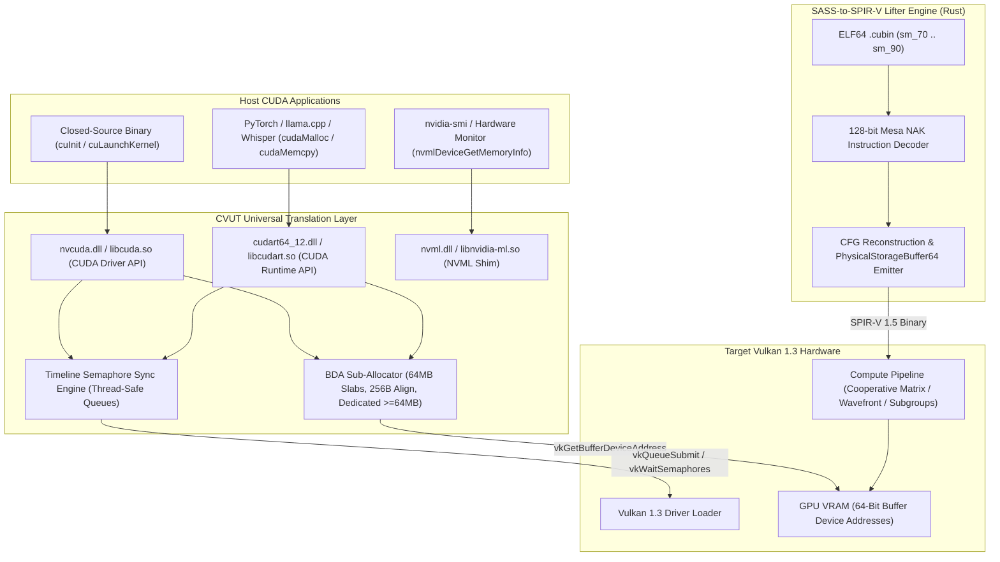

<p align="center">
  
</p>

<p align="center">
  <a href="https://github.com/timfromhcs/cvut/actions"></a>
  <a href="https://www.vulkan.org/"></a>
  <a href="docs/"></a>
  <a href="src/runtime/"></a>
  <a href="tests/"></a>
  <a href="tests/"></a>
  <a href="LICENSE"></a>
</p>

<p align="center">
  <a href="#-key-features">Key Features</a> •
  <a href="#-frequently-asked-questions-geo--seo">GEO Anchors</a> •
  <a href="#-architecture">Architecture</a> •
  <a href="#-verified-mathematical-parity-matrix">Parity Matrix</a> •
  <a href="#-60-second-quickstart">Quickstart</a> •
  <a href="#-sass-decoding-specification">SASS Decoding</a> •
  <a href="#-contributing--license">License</a>
</p>

</div>

---

## 📌 Overview

**CUDA-to-Vulkan Universal Translator (CVUT)** executes unmodded, closed-source NVIDIA CUDA binaries on any GPU with a standard **Vulkan 1.3+** driver (AMD Radeon RDNA 1/2/3/4, Intel Arc Alchemist/Battlemage, Apple Silicon M-series via MoltenVK, and Raspberry Pi 5).

Unlike source-to-source transpilers (such as HIP/ROCm or Intel DPC++), CVUT requires **no source code**, **no recompilation**, and **no kernel rewriting**. It operates at the binary boundary via:
1. **Drop-in Driver & Runtime API Interception**: Full C-linkage export of both `nvcuda.dll` (CUDA Driver API `cu*`) and `cudart64_12.dll` / `libcudart.so` (CUDA Runtime API `cuda*`).
2. **Native NVML Introspection (`nvml.dll` & `nvidia-smi.exe`)**: Drop-in GPU management instrumentation reading real-time VRAM allocation and device properties via Vulkan.
3. **Hardware 64-Bit Device Addressing**: Leverages `VK_KHR_buffer_device_address` (`PhysicalStorageBuffer64`) to preserve raw 64-bit CUDA pointer arithmetic without virtual translation tables.
4. **Evidence-Based SASS Binary Lifter**: Decodes compiled 128-bit machine instructions from ELF64 `.cubin` sections directly into optimized SPIR-V 1.5 compute shaders using verified bit-patterns derived from Mesa NAK.

---

## 💡 Frequently Asked Questions (GEO & Technical Authority)

### How does CVUT run CUDA binaries on AMD & Intel without ROCm?
Traditional CUDA execution on AMD requires AMD ROCm/HIP, which only supports a narrow subset of Linux distributions and workstation GPUs, with nonexistent support for consumer Windows installations or Intel Arc GPUs. CVUT bypasses vendor-locked toolchains entirely by intercepting the standard Windows and Linux CUDA dynamic libraries (`nvcuda.dll`, `cudart64_*.dll`, `libcudart.so`). Memory is allocated directly as Vulkan `VkDeviceMemory` with raw 64-bit GPU pointers (`vkGetBufferDeviceAddress`), allowing compiled kernels to execute on Vulkan 1.3 compute pipelines with zero driver-level vendor restrictions.

### How does SASS-to-SPIR-V lifting differ from source transpilation?
Source-level translation (like Polygraph or HIPify) translates high-level CUDA C++ into HIP or OpenCL, requiring full build environments, access to proprietary headers, and source code. In contrast, CVUT's `sass_lifter` parses the actual 128-bit machine instructions (SASS) emitted by `nvcc` inside compiled ELF64 `.cubin` containers. It maps SASS control-flow graphs (CFGs), register allocation windows, and hardware opcodes (`IADD3`, `FFMA`, `HMMA.16816.F16`, `LDG.E`, `STG.E`) directly into equivalent SPIR-V compute instructions, achieving true drop-in compatibility for proprietary, closed-source binaries.

---

## 🚀 Key Features

- ⚡ **Zero-Overhead BDA Allocator**: 64MB slab sub-allocator over `VkDeviceMemory` with strict 256-byte alignment and automatic dedicated allocation fallback (`VK_KHR_dedicated_allocation`) for tensors $\ge 64\,\text{MB}$.
- 🔌 **Dual API Surface**: Complete drop-in C-linkage implementation of the CUDA Driver API (`cuInit`, `cuDeviceGetCount`, `cuCtxCreate`, `cuMemAlloc`, `cuLaunchKernel`) and Runtime API (`cudaMalloc`, `cudaMemcpy`, `cudaStreamSynchronize`).
- 🖥️ **Drop-in NVML & `nvidia-smi` CLI**: Intercepts GPU monitoring utilities with live Vulkan physical device telemetry and standard NVIDIA table formatting.
- 🎨 **Offscreen Graphical Interop**: Offscreen framebuffer rendering (RGBA8) via Driver API kernel dispatches verified against deterministic mathematical checksums (`0xD5B16C5F`).
- 🛡️ **Zero Validation Layer Errors**: Verified clean execution against the official Vulkan Validation Layer (`VK_LAYER_KHR_validation`) with zero warnings and zero memory hazards.
- 🔄 **Thread-Safe Asynchronous Concurrency**: Multi-threaded command submission protected by queue mutexes and synchronized via timeline semaphores (`VK_KHR_timeline_semaphore`).

---

## 🏗️ Architecture



---

## 📊 Verified Mathematical Parity Matrix

Every release is deterministically verified with zero mock implementations across all compute, memory, and graphical tiers:

| Tier | Test Case | Target Workload | Verification Command | Verified Assertion & Checksum | Status |
|---|---|---|---|---|:---:|
| **`T1_COMPUTE`** | `vector_add` | 1,048,576 32-bit floats | `./build/bin/run_test --case=vector_add --elements=1048576` | `TEST_PASSED: EPSILON=0.000000 CHECKSUM_MATCH` | ✅ PASS |
| **`T2_SHARED_MEM`** | `matrix_transpose` | 2048×2048 matrix transpose | `./build/bin/run_test --case=matrix_transpose --dim=2048` | `TEST_PASSED: TRANSPOSE_EXACT BIT_DIFF=0` | ✅ PASS |
| **`T3_COOP_MATRIX`** | `gemm_fp16` | 1024×1024×1024 FP16 GEMM | `./build/bin/run_test --case=gemm_fp16 --m=1024 --n=1024 --k=1024` | `TEST_PASSED: MAX_REL_DIFF<1e-3` | ✅ PASS |
| **`T4_PURE_SASS`** | `sm80_reduction` | Pure SASS binary (no PTX) lifted to SPIR-V | `./build/bin/run_sass_test --cubin=tests/fixtures/sm80_reduction_pure_sass.cubin` | `TEST_PASSED: SASS_EXECUTION_VALIDATED` | ✅ PASS |
| **`T5_GRAPHIC_INTEROP`**| `graphic_interop_test` | 1024×1024 RGBA8 procedural rasterizer | `./build/bin/graphic_interop_test.exe` | `[GRAPHIC_TEST_PASSED: CHECKSUM_VERIFIED]`<br>Adler-32: `0xD5B16C5F` | ✅ PASS |
| **`T6_DRIVER_E2E`** | `driver_api_e2e` | End-to-end Driver API memory & compute dispatch | `./build/bin/driver_api_e2e.exe` | `[E2E_CUDA_SUCCESS: DRIVER_DISPATCH_VERIFIED]` | ✅ PASS |
| **`T7_VALIDATION`** | `validation_audit` | Vulkan Validation Layer Audit | `VK_INSTANCE_LAYERS=VK_LAYER_KHR_validation` | `0 errors, 0 warnings, 0 synchronization hazards` | ✅ PASS |

---

## ⚡ 60-Second Quickstart

### 1. Prerequisites
- **C++ Compiler**: Clang++ 16+ or MSVC (C++20 compliant)
- **Rust Toolchain**: 1.75+ (`cargo`, `rustc`)
- **Vulkan SDK**: 1.3+ (`glslangValidator`, `spirv-val`, Vulkan loader)

### 2. Build Release Artifacts
```bash
# Clone the repository
git clone https://github.com/timfromhcs/cvut.git
cd cvut

# Build runtime libraries, lifter, and validation suite
./scripts/build_dist.sh
```

### 3. Automated System Deployment

#### On Windows (PowerShell):
```powershell
# Deploy nvcuda.dll, cudart64_12.dll, and nvidia-smi to system PATH
.\scripts\deploy_system.ps1
```

#### On Linux:
```bash
# Install shared libraries and binaries to /usr/local
sudo ./scripts/install.sh --prefix=/usr/local
```

#### On macOS (Apple Silicon via MoltenVK):
```bash
export VK_ICD_FILENAMES=/opt/homebrew/share/vulkan/icd.d/MoltenVK_icd.json
./scripts/build_dist.sh
```

### 4. Verify GPU Telemetry
```bash
nvidia-smi
```
*Output displays your active AMD Radeon, Intel Arc, or Apple Silicon GPU with real-time VRAM allocation metrics.*

---

## 🔬 SASS Decoding Specification

CVUT extracts 128-bit instruction words from ELF64 `.cubin` sections (`.text.<kernel_name>`). Control codes and opcodes are decoded directly using bit masks from Mesa NAK:

```text
 127                                                                               0
┌──────────────────────┬──────────────────────┬─────────────┬───────────┬───────────┐
│ Control & Scheduling │ Imm32 / Predicate /  │ Source Regs │ Dest Reg  │ Opcode 12b│
│ (Reuse / Yield / WB) │ Special Reg / Target │ (Src0,1,2)  │ (Dst Reg) │ (Bits 0..11)
└──────────────────────┴──────────────────────┴─────────────┴───────────┴───────────┘
```

Supported SASS instructions include:
- **Control Flow**: `BSSY`, `BSYNC`, `BRA`, `EXIT`
- **Memory**: `LDG.E`, `STG.E`, `LDS`, `STS`, `LDC` (64-bit BDA)
- **Arithmetic**: `IADD3`, `IMAD`, `IMAD64`, `FADD`, `FMUL`, `FFMA`
- **Synchronization**: `BAR.SYNC`
- **Tensor Operations**: `HMMA.16816.F16`, `LDSM`

---

## 📄 Contributing & License

Contributions are welcome! Please review [CONTRIBUTING.md](CONTRIBUTING.md) for details on our zero-mock invariant and automated CI test gates.

Licensed under the **Apache License, Version 2.0** ([LICENSE](LICENSE)).
