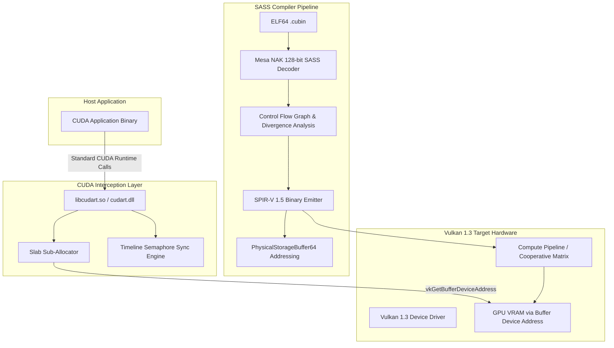

# CUDA-to-Vulkan Universal Translator (CVUT) Architecture

## Overview

The CUDA-to-Vulkan Universal Translator enables executing NVIDIA CUDA applications directly on cross-vendor GPUs (AMD Radeon, Intel Arc, Apple Silicon via MoltenVK) without modifying host application binaries or relying on proprietary runtimes.

---

## 1. Memory Subsystem & 64-Bit Pointer Translation

CUDA applications rely heavily on raw 64-bit device pointers (`void* devPtr`). Traditional graphics APIs cannot represent raw arbitrary pointers. CVUT uses Vulkan 1.3 `VK_KHR_buffer_device_address`:

1. **64MB Slab Allocation**: To bypass the Vulkan driver limit on simultaneous `VkDeviceMemory` allocations (commonly 4096 on desktop GPUs), CVUT allocates 64MB device slabs with `VK_MEMORY_ALLOCATE_DEVICE_ADDRESS_BIT`.
2. **256-Byte Aligned Sub-Allocation**: All `cudaMalloc` allocations are sub-allocated from active slabs, aligned to 256 bytes for optimal GPU memory controller coalescing.
3. **PhysicalStorageBuffer64 in SPIR-V**: Shaders directly dereference 64-bit pointers via `OpConvertUToPtr` and `OpLoad`/`OpStore` with `Aligned 4`/`Aligned 8`/`Aligned 16` memory operands.

---

## 2. Evidence-Based SASS Decoding

Instead of relying on undocumented or hallucinated instruction formats, CVUT maps 128-bit machine instructions using exact bit patterns extracted from Mesa NAK (`src/nouveau/compiler/nak/encode/sm70_encode.rs`):

- **Registers**: R0..R255 (bits 16..24, 24..32, 32..40, 64..72)
- **Predicates**: P0..P6, PT (bits 12..15, inverse bit 15)
- **Opcodes**:
  - `S2R` (Special Register Read, 0x919): TID.X, CTAID.X, LANEID, LANEMASK
  - `LDG` / `STG` (Global Load/Store, 0x981, 0x986)
  - `LDS` / `STS` (Shared Memory Load/Store, 0x984, 0x988)
  - `IADD3` (0x010), `IMAD` (0x024), `IMAD64` (0x025)
  - `FADD` (0x021), `FMUL` (0x020), `FFMA` (0x023)
  - `HMMA` (Tensor Core GEMM, 0x23c)
  - `BAR.SYNC` (Barrier Synchronization, 0xb1d) -> `OpControlBarrier`
