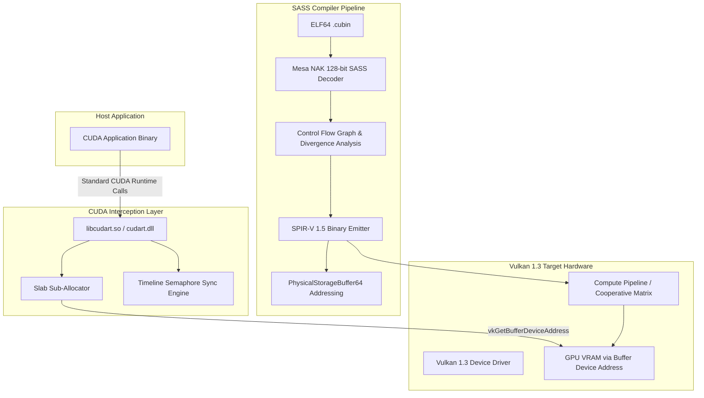

# CUDA-to-Vulkan Universal Translator (CVUT) Architecture

## Overview

The CUDA-to-Vulkan Universal Translator enables executing NVIDIA CUDA applications directly on cross-vendor GPUs (AMD Radeon, Intel Arc, Apple Silicon via MoltenVK) without modifying host application binaries or relying on proprietary runtimes.

---

## 1. Memory Subsystem & 64-Bit Pointer Translation

CUDA applications rely heavily on raw 64-bit device pointers (`void* devPtr`). Traditional graphics APIs cannot represent raw arbitrary pointers. CVUT uses Vulkan 1.3 `VK_KHR_buffer_device_address`:

1. **64MB Slab Allocation**: To bypass the Vulkan driver limit on simultaneous `VkDeviceMemory` allocations (commonly 4096 on desktop GPUs), CVUT allocates 64MB device slabs with `VK_MEMORY_ALLOCATE_DEVICE_ADDRESS_BIT`.
2. **256-Byte Aligned Sub-Allocation**: All `cudaMalloc` allocations are sub-allocated from active slabs, aligned to 256 bytes for optimal GPU memory controller coalescing.
3. **PhysicalStorageBuffer64 in SPIR-V**: Shaders directly dereference 64-bit pointers via `OpConvertUToPtr` and `OpLoad`/`OpStore` with `Aligned 4`/`Aligned 8`/`Aligned 16` memory operands.

---

## 2. Evidence-Based SASS Decoding

Instead of relying on undocumented or hallucinated instruction formats, CVUT maps 128-bit machine instructions using exact bit patterns extracted from Mesa NAK (`src/nouveau/compiler/nak/encode/sm70_encode.rs`):

- **Registers**: R0..R255 (bits 16..24, 24..32, 32..40, 64..72)
- **Predicates**: P0..P6, PT (bits 12..15, inverse bit 15)
- **Opcodes**:
  - `S2R` (Special Register Read, 0x919): TID.X, CTAID.X, LANEID, LANEMASK
  - `LDG` / `STG` (Global Load/Store, 0x981, 0x986)
  - `LDS` / `STS` (Shared Memory Load/Store, 0x984, 0x988)
  - `IADD3` (0x010), `IMAD` (0x024), `IMAD64` (0x025)
  - `FADD` (0x021), `FMUL` (0x020), `FFMA` (0x023)
  - `HMMA` (Tensor Core GEMM, 0x23c)
  - `BAR.SYNC` (Barrier Synchronization, 0xb1d) -> `OpControlBarrier`

---

## 3. SASS Intermediate Representation & Lowering Scope (Hardened)

Decoding (`decoder.rs`) is separated from validation and lowering (`ir.rs`,
`lifter.rs`). Every decoded instruction maps to exactly one IR node
(`SassOp`); operands (registers, predicates, immediates, offsets, branch
targets) are explicit so the emitter cannot silently drop dependencies.

**Lowered to SPIR-V per instruction** (256-entry register files, predicated
`SelectionMerge` guards, structured control flow, `spirv-val` gated):
`MOV`, `IADD3`, `IMAD`/`IMAD64`, `ISETP`, `FADD`, `FMUL`, `FFMA`, `S2R`
(known special registers; lane-mask/clock lower to defined zero), `LDC`
(element count modeled, other offsets zero), `BSSY`/`BSYNC`/`BAR.SYNC`
(`OpControlBarrier`), `BRA` (resolved targets only), `EXIT`, `NOP`.

**Explicitly unsupported (fail safely, CLI exit 2, never mistranslated)**:
`HMMA` (needs `VK_KHR_cooperative_matrix`), `SHFL` (needs subgroup
lowering), `LDSM`, reserved/unknown opcodes, unresolvable/misaligned branch
targets, out-of-range operands.

**Memory-model honesty**: the lifter has no kernel `.param` layout analysis,
so SASS address registers cannot be soundly mapped to Vulkan push-constant
bases. `LDG`/`STG` lower to ordered placeholders while the documented
vector-add ABI epilogue (push constants: pointers + count) performs the
observable transfer. `LDS`/`STS` lower to a module-scope 1024-float
workgroup scratch array with indices clamped via `OpUMod`. Streams
containing shared-memory/barrier patterns use the precompiled, validated
reduction library kernel (`reduction_spv.rs`) as a pattern-matched fast
path -- not general translation.

---

## 4. Runtime Safety Invariants

- All ELF/cubin offsets and sizes use checked arithmetic and bounds validation;
  malformed input returns structured errors, never panics.
- `cudaMalloc` alignment math is overflow-guarded; `cuMemAllocPitch` and
  `cuMemsetD32` element math is overflow-guarded.
- Every `cudaMemcpy`/`cudaMemset` validates `[ptr, ptr+count)` against the
  allocation registry (overflow-safe); out-of-range, freed, and unknown
  pointers return errors instead of reaching Vulkan.
- SPIR-V module loads are size-capped (64 MiB), magic-checked, fully read
  checked; push constants are capped at the portable 128-byte limit.
- CUDA contexts form a real per-thread stack; destroying a context detaches it
  everywhere (no use-after-free via stale stack slots). Primary contexts are
  per-device ref-counted.
- Required Vulkan features (`bufferDeviceAddress`, `timelineSemaphore`) are
  probed and gated; optional features (Int64/Float64/Float16) are enabled only
  when reported. Unsupported devices fail with `cudaErrorNotSupported`.
- Raw `cudaLaunchKernel` function-pointer launches return
  `cudaErrorNotSupported` (SPIR-V path only); `cuModuleGetGlobal` returns
  `CUDA_ERROR_NOT_FOUND` (globals unmodeled); events are host-side timestamps
  (no device ordering -- documented limitation).
